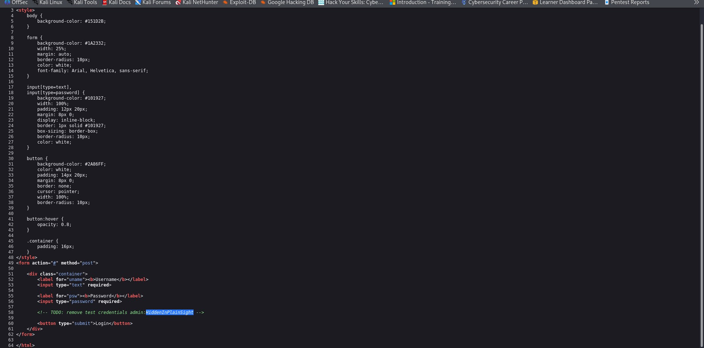
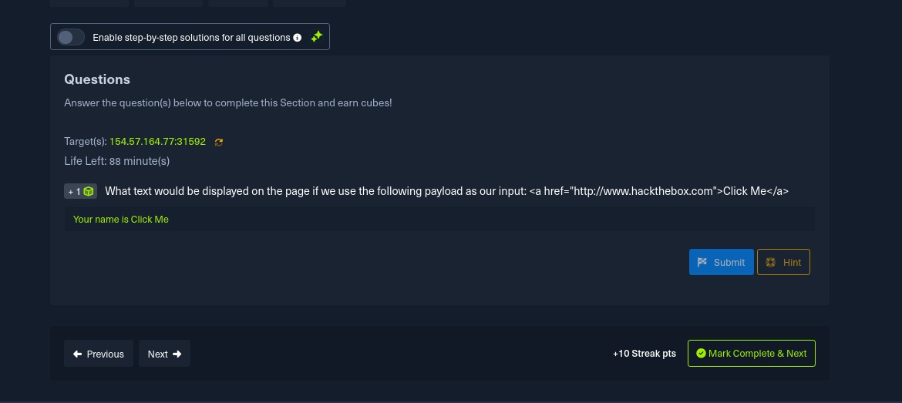
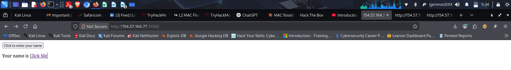
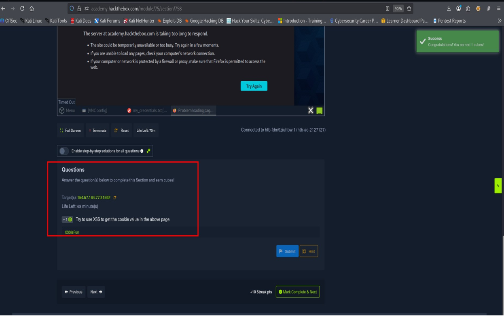
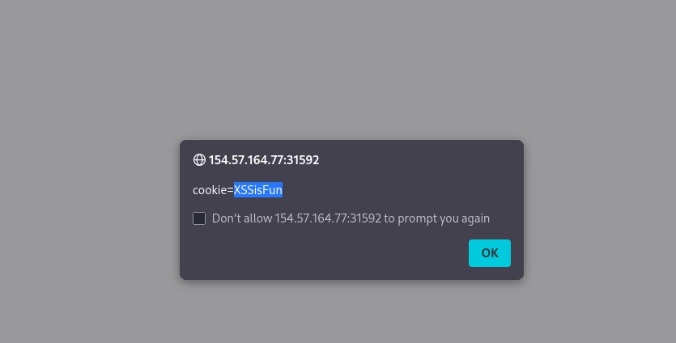
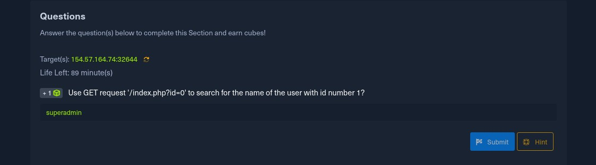
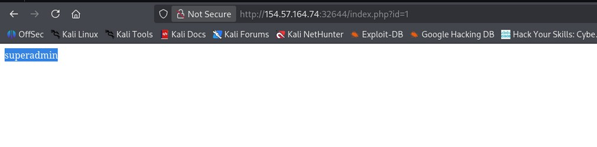

# Introduction to Web Applications - HackTheBox

**Platform:** HackTheBox Academy | Module: Front-End & Back-End Web Application Security
**Author:** Brown Samita | Nairobi, Kenya
**Achievement:** [academy.hackthebox.com/achievement/2127127/75](https://academy.hackthebox.com/achievement/2127127/75)

## Introduction

Web applications are at the core of almost every modern service we interact with — from email platforms and banking portals to social media and e-commerce sites. Unlike desktop applications, web apps run on remote servers and are accessed through a browser, making them universally accessible but also widely targeted by attackers.

This module provides a foundational understanding of how web applications are structured, what technologies power them, and the key security risks they face. The goal is to build enough knowledge of the web stack to confidently approach offensive web application assessments.

The module was completed as part of a structured cybersecurity learning path and covered both theoretical concepts and hands-on practical exercises involving real vulnerabilities in a controlled lab environment.

---

## 1. Front-End Technologies

### 1.1 HTML, CSS, and JavaScript

Every web page a user sees is built from three core technologies: HTML structures the content, CSS controls the visual presentation, and JavaScript adds interactivity and dynamic behaviour. Understanding how these work together — and how they can be abused — is essential for web security.

### 1.2 HTML Injection

HTML Injection occurs when user-supplied input is rendered directly in the page without proper sanitisation. An attacker can inject arbitrary HTML tags to alter page content, redirect users, or craft convincing phishing pages hosted on a legitimate domain.

The exercise below demonstrates finding hardcoded credentials left in an HTML comment — a common developer mistake where test credentials like `admin:HiddenInPlainSight` were committed to source code and never removed before deployment.

*Figure 1: HTML source code showing a CSS-styled login form and a TODO comment exposing admin credentials in plain text.*

---

## 2. Cross-Site Scripting (XSS)

### 2.1 What is XSS?

Cross-Site Scripting (XSS) is a vulnerability that allows an attacker to inject malicious JavaScript into a web page that is then executed by other users' browsers. It exploits the browser's trust of content served from a legitimate site. There are three main types: Reflected XSS, Stored XSS, and DOM-based XSS.

### 2.2 HTML Injection via XSS Payload

The first practical exercise involved injecting an anchor tag as user input. The payload `<a href="http://www.hackthebox.com">Click Me</a>` was submitted to a name input field. Because the application did not sanitise input before rendering it on screen, the browser interpreted it as a real HTML link.

The question asked what text would be displayed — the answer was "Click Me", since the browser rendered the anchor tag and displayed its inner text rather than the raw HTML string.

*Figure 2: HTB Academy question asking about HTML injection payload rendering — answer: "Click Me".*

*Figure 3: Browser rendering the injected anchor tag — "Your name is Click Me" displayed as a clickable hyperlink.*

### 2.3 Cookie Theft via XSS

The second XSS exercise required using a JavaScript payload to extract the page's cookie value. By injecting a script that calls `alert(document.cookie)`, the browser executes the JavaScript in the context of the vulnerable page and displays the stored cookie.

The cookie value `XSSisFun` was successfully retrieved through this technique, demonstrating how XSS can be leveraged to steal session tokens and hijack authenticated sessions — one of the most impactful real-world consequences of XSS vulnerabilities.

*Figure 4: HTB Academy lab showing the XSS exercise with the cookie answer "XSSisFun" submitted successfully (+1 cube earned).*

*Figure 5: Browser alert popup triggered by XSS payload — displaying `cookie=XSSisFun` retrieved from the vulnerable page.*

---

## 3. Back-End Components & APIs

### 3.1 Web Servers, Databases, and Frameworks

The back-end of a web application consists of several layers working together: a web server (such as Apache, Nginx, or IIS) receives requests; a server-side language (PHP, Python, Node.js, etc.) processes application logic; and a database (SQL or NoSQL) stores persistent data. The interaction between these components is where many critical vulnerabilities originate.

### 3.2 GET Request Parameter Manipulation

One practical exercise demonstrated how unsanitised URL parameters can expose data. By sending a GET request to `/index.php?id=0`, the application returned user data based on the `id` parameter. Incrementing the `id` value to 1 revealed the username of the first account in the database: `superadmin`.

This type of vulnerability — where user-controlled input is passed directly to a database query — is the foundation of SQL Injection attacks, which appear in the OWASP Top 10 as one of the most critical web application risks.

*Figure 6: HTB Academy question using GET parameter `?id=1` to retrieve username "superadmin" from the back-end.*

*Figure 7: Browser displaying the result of the GET request — "superadmin" returned by the back-end application.*

---

## 4. OWASP Top 10 & Public Vulnerabilities

The module also introduced the OWASP Top 10, a widely recognised list of the most critical web application security risks. Key categories covered include:

- **Broken Access Control** — users accessing data or functions beyond their permissions
- **Cryptographic Failures** — sensitive data exposed due to weak or absent encryption
- **Injection** — SQL, OS, and LDAP injection through unsanitised user input
- **Insecure Design** — architectural flaws that lead to vulnerable systems
- **Security Misconfiguration** — default settings, open cloud storage, verbose error messages
- **Vulnerable and Outdated Components** — using libraries or frameworks with known CVEs
- **Identification and Authentication Failures** — weak session management and credential handling
- **CSRF (Cross-Site Request Forgery)** — tricking authenticated users into performing unwanted actions

Understanding the OWASP Top 10 provides a practical framework for both identifying vulnerabilities and prioritising remediation efforts in real-world applications.

---

## MITRE ATT&CK Mapping

Web application weaknesses like these map most naturally to OWASP, but each finding also lines up with adversary behavior tracked in MITRE ATT&CK — useful when the same finding needs to feed into detection engineering or a broader threat model:

| Observed Behavior | Tactic | Technique | ID |
|---|---|---|---|
| Admin credentials left in an HTML comment, visible in page source | Credential Access | Unsecured Credentials: Credentials In Files | [T1552.001](https://attack.mitre.org/techniques/T1552/001/) |
| Unsanitised input rendered directly into the page (HTML Injection) | Initial Access | Drive-by Compromise | [T1189](https://attack.mitre.org/techniques/T1189/) |
| JavaScript payload executed in victim's browser via XSS to steal session cookie | Credential Access | Steal Web Session Cookie | [T1539](https://attack.mitre.org/techniques/T1539/) |
| Stolen session cookie reused to access an authenticated session | Defense Evasion / Initial Access | Use Alternate Authentication Material: Web Session Cookie | [T1550.004](https://attack.mitre.org/techniques/T1550/004/) |
| Sequential `id` parameter manipulation used to enumerate database records | Discovery / Collection | Data from Information Repositories | [T1213](https://attack.mitre.org/techniques/T1213/) |

**Why this matters:** OWASP categorizes the *vulnerability class* (what's broken), while ATT&CK captures the *adversary behavior* that exploits it (what an attacker actually does). Mapping both together makes findings usable by two different audiences — developers fixing the code, and a SOC building detections for the behavior.

---

## Conclusion

This module provided a comprehensive introduction to web application architecture and security fundamentals. The key topics covered include:

- What web applications are and how they differ from traditional desktop software
- Common web application architectures and the distinction between front-end and back-end
- Core front-end technologies: HTML, CSS, and JavaScript — their usage, syntax, and examples
- Front-end security risks including HTML Injection, XSS (Cross-Site Scripting), and CSRF
- Back-end components: web servers, databases (SQL and NoSQL), and development frameworks
- The role of APIs in modern web applications and how they can be exploited
- An introduction to the OWASP Top 10 for Web Applications

Through hands-on exercises, practical skills were developed in identifying and exploiting HTML Injection, Cross-Site Scripting (XSS) — including cookie theft via `alert(document.cookie)` — and back-end parameter manipulation via crafted GET requests to expose database records.

These fundamentals form the foundation required to move into offensive web application modules. A solid understanding of how web applications are built is essential before attempting to break them — knowing the technology is the first step to finding its weaknesses.

