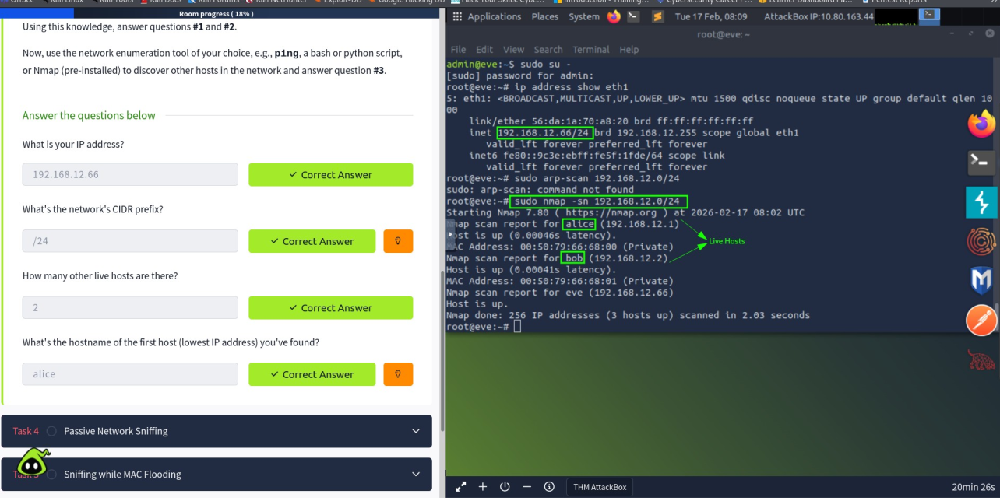
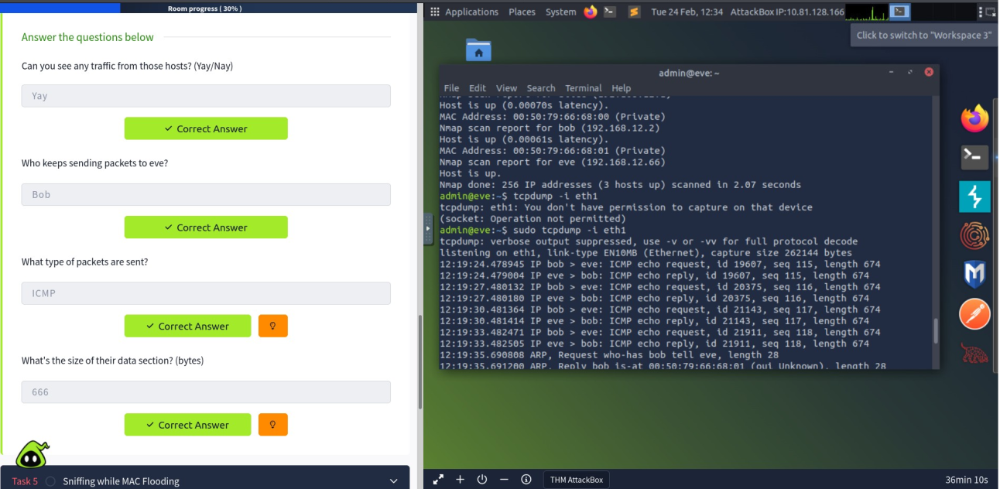
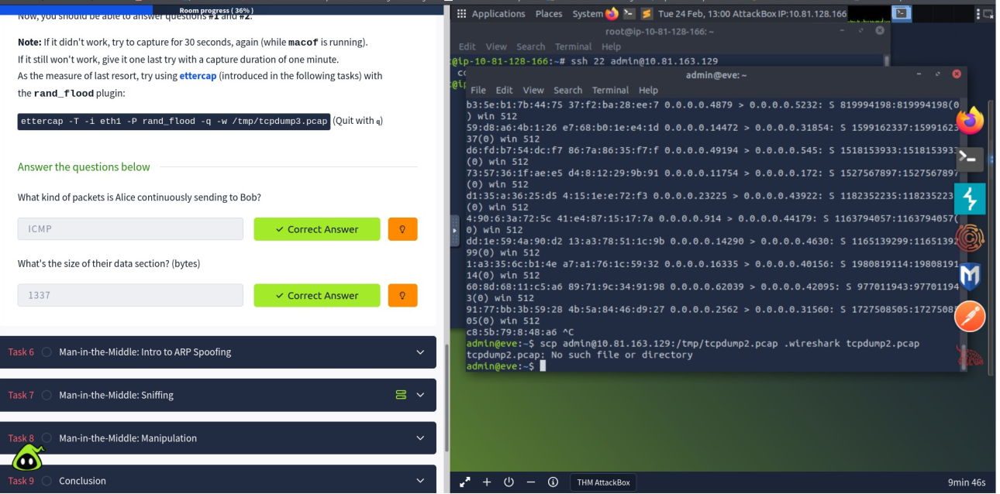
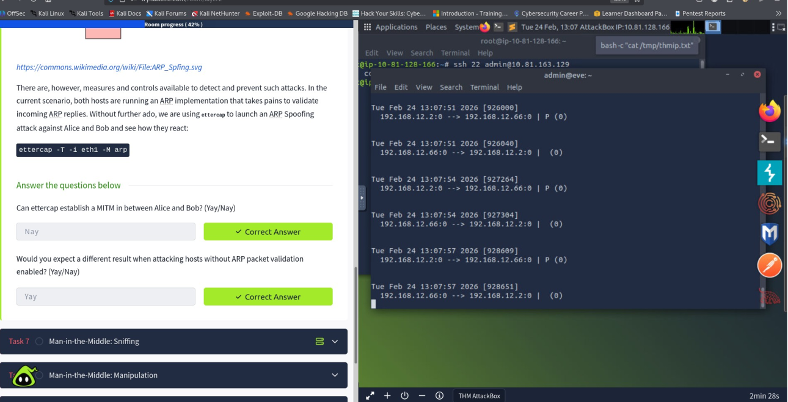
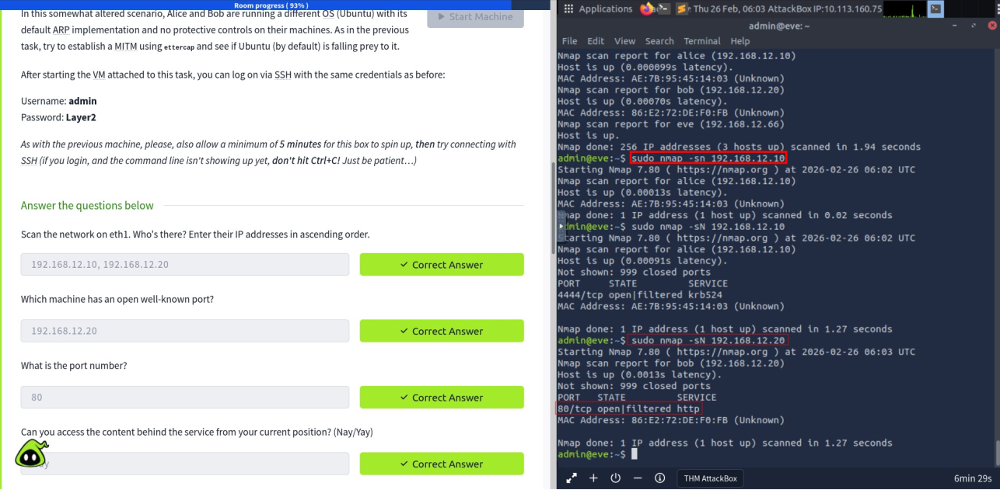
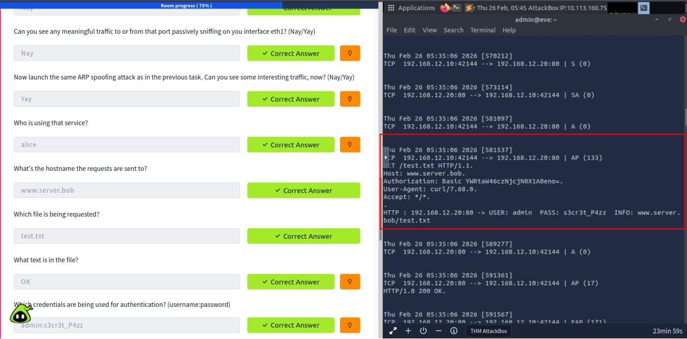
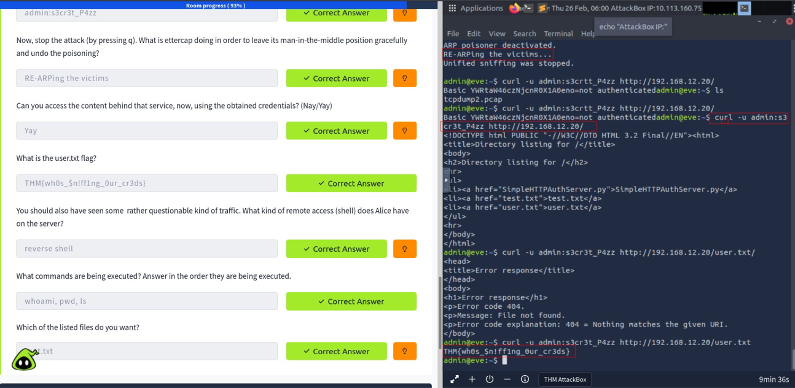

# L2 MAC Flooding & ARP Spoofing - TryHackMe

**Platform:** TryHackMe | Room: [Layer2](https://tryhackme.com/room/layer2)
**Author:** Brown Samita | Nairobi, Kenya
## Achievement 
Room successfully completed on TryHackMe: [tryhackme.com/room/layer2](https://tryhackme.com/room/layer2)

## Introduction

This write-up documents the hands-on completion of the TryHackMe "L2 MAC Flooding & ARP Spoofing" room. The lab explores attack techniques that target Layer 2 of the OSI model — specifically exploiting weaknesses in the MAC address learning mechanism of network switches (MAC flooding) and the stateless, trust-based nature of the Address Resolution Protocol (ARP spoofing).

In a typical switched network, a switch maintains a Content Addressable Memory (CAM) table that maps MAC addresses to physical ports, allowing it to forward frames directly to the intended recipient. MAC flooding overwhelms this table with bogus entries, causing the switch to fall back to broadcast mode — effectively turning it into a hub and enabling passive eavesdropping. ARP spoofing goes further by poisoning the ARP cache of target hosts, redirecting their traffic through an attacker-controlled machine — a classic Man-in-the-Middle (MITM) position.

The lab environment placed the attacker on the same Layer 2 network segment as two victim hosts, "alice" and "bob", managed through a host named "eve". The primary tools used were Nmap for host discovery, tcpdump for passive sniffing, ettercap's `rand_flood` plugin for MAC flooding, and ettercap's `arp` plugin for ARP spoofing and MITM interception.

---

## 2. Network Reconnaissance & Host Discovery

The first objective was to enumerate the local network segment. After elevating privileges with `sudo su -`, the `ip address show eth1` command revealed that the attacker machine (eve) held the IP address `192.168.12.66/24`. This confirmed the subnet to work within.

`arp-scan` was attempted but was not available on the system ("command not found"), so Nmap was used instead with a ping sweep to identify live hosts on the subnet:

```bash
sudo nmap -sn 192.168.12.0/24
```

The scan returned three live hosts: alice (`192.168.12.1`), bob (`192.168.12.2`), and eve (`192.168.12.66`) — the attacker's own machine. This provided the full picture of the network landscape.



*Figure 1: Network scan with `nmap -sn` revealing alice, bob, and eve on the 192.168.12.0/24 subnet.*

**Findings:**
- Attacker IP: `192.168.12.66`
- CIDR prefix: `/24`
- Other live hosts: `2`
- First discovered host: `alice`

---

## 3. Passive Network Sniffing

With the hosts identified, the next step was to passively capture traffic on the interface. Running `tcpdump` without root privileges produced a permission error; re-running with `sudo` resolved this:

```bash
sudo tcpdump -i eth1
```

In a properly functioning switched network, a host should only see traffic addressed to itself (unicast) or broadcast/multicast frames. The captured output confirmed this: ICMP echo requests and replies were visible between hosts, along with ARP messages used to resolve IP-to-MAC mappings. Notably, bob was continuously sending ICMP packets to eve, with a data section size of 666 bytes. The traffic visible at this stage was limited, as the switch was still operating normally and selectively forwarding frames.



*Figure 2: tcpdump capturing ICMP traffic between hosts; bob sending ICMP packets to eve with 666-byte data sections.*

---

## 4. Sniffing While MAC Flooding

To gain visibility into traffic not destined for the attacker's machine, MAC flooding was performed using ettercap's `rand_flood` plugin. This technique floods the switch's CAM table with thousands of fake MAC address entries, exhausting its memory. Once full, the switch can no longer make forwarding decisions and begins broadcasting all traffic out of every port — just like a hub. This allows the attacker to passively capture traffic between other hosts.

```bash
ettercap -T -i eth1 -P rand_flood -q -w /tmp/tcpdump3.pcap
```

With MAC flooding active and a packet capture running in parallel, traffic between alice and bob became visible. Alice was observed continuously sending ICMP packets to bob, with a data section size of 1337 bytes. The terminal shows the volume of spoofed entries being injected into the network, and a separate SSH session to the capture machine demonstrates the use of `scp` to transfer the `.pcap` file for analysis.



*Figure 3: ettercap `rand_flood` plugin actively flooding the CAM table; traffic between alice and bob (ICMP, 1337 bytes) now visible.*

---

## 5. Man-in-the-Middle: ARP Spoofing Introduction

With the conceptual foundation established, the lab introduced ARP spoofing as a more targeted and stealthy MITM technique. Unlike MAC flooding (which is noisy and causes network-wide disruption), ARP spoofing surgically poisons the ARP caches of specific target hosts, making them believe the attacker's MAC address belongs to the other party's IP address.

In this first ARP spoofing scenario, both alice and bob were running an OS with ARP packet validation enabled — a protective control that verifies incoming ARP replies against expected behaviour. ettercap was launched with its ARP plugin:

```bash
ettercap -T -i eth1 -M arp
```

Despite the attack running, ettercap could not establish a MITM position. This was the expected outcome — the hosts' ARP validation rejected the poisoned replies. The task reinforced an important lesson: the success of ARP spoofing is highly dependent on whether the target OS validates ARP replies. If the hosts lacked this control, the attack would succeed. The terminal confirmed that traffic was still flowing directly between alice and bob without being redirected through eve.



*Figure 4: ARP spoofing attempt with ettercap; attack fails due to ARP validation on victim hosts.*

---

## 6. Man-in-the-Middle: Sniffing

The lab then switched to a new VM running Ubuntu with its default ARP implementation and no protective controls — a realistic representation of many unprotected enterprise endpoints. A fresh network scan revealed the updated host IPs: alice at `192.168.12.10` and bob at `192.168.12.20`. Port scanning uncovered that bob (`192.168.12.20`) had port 80/tcp open, indicating an HTTP web service — though it could not be accessed from the attacker's current unauthenticated position.

```bash
sudo nmap -sN 192.168.12.10
sudo nmap -sN 192.168.12.20
```



*Figure 5: Nmap scan of the new Ubuntu VM; alice (192.168.12.10) and bob (192.168.12.20) identified; port 80 open on bob.*

Passive sniffing on `eth1` at this stage produced no meaningful traffic to or from port 80. However, once the ARP spoofing attack was launched again, intercepted traffic became visible immediately:

```bash
sudo ettercap -T -i eth1 -M arp
```


*Figure 6: ettercap ARP spoofing command used to poison caches of alice and bob, enabling MITM positioning.*

The captured session revealed alice making an HTTP GET request to `www.server.bob` for the file `test.txt`, with Basic Authentication credentials transmitted in cleartext.



*Figure 7: Intercepted HTTP session: alice authenticating to www.server.bob; credentials (`admin:s3cr3t_P4zz`) captured in cleartext.*

**Captured details:**
- Host: `www.server.bob`
- File requested: `test.txt`
- File content: `OK`
- Credentials: `admin:s3cr3t_P4zz`

---

## 7. Man-in-the-Middle: Manipulation & Flag Retrieval

The final task demonstrated the full impact of a successful MITM attack — going beyond passive credential interception to active session use. Using the captured credentials (`admin:s3cr3t_P4zz`), the lab showed that the attacker could directly access the HTTP service on bob (`192.168.12.20`) using `curl`:

```bash
curl -u admin:s3cr3t_P4zz http://192.168.12.20/
```

The server returned a directory listing containing three files: `SimpleHTTPAuthServer.py`, `test.txt`, and `user.txt`. Fetching `user.txt` returned the flag: `THM{wh0s_$n!ff1ng_0ur_cr3ds}`.



*Figure 8: Using captured credentials to access the HTTP service; flag `THM{wh0s_$n!ff1ng_0ur_cr3ds}` retrieved from `user.txt`.*

Additionally, the intercepted traffic revealed that alice had a reverse shell connection running to the server, executing commands `whoami`, `pwd`, and `ls` in sequence. When ettercap was stopped by pressing `q`, it gracefully restored the original ARP tables by re-ARPing the victims — confirming that the tool cleans up after itself rather than leaving hosts with a poisoned cache.

**Flag:** `THM{wh0s_$n!ff1ng_0ur_cr3ds}`

---

## MITRE ATT&CK Mapping

| Observed Behavior | Tactic | Technique | ID |
|---|---|---|---|
| `nmap -sn` ping sweep to enumerate live hosts on the subnet | Discovery | Network Service Discovery | [T1046](https://attack.mitre.org/techniques/T1046/) |
| Passive capture of ICMP/ARP traffic with tcpdump | Discovery / Collection | Network Sniffing | [T1040](https://attack.mitre.org/techniques/T1040/) |
| CAM table exhaustion via `rand_flood`, forcing the switch into hub-like broadcast behavior | Credential Access / Collection | Adversary-in-the-Middle | [T1557](https://attack.mitre.org/techniques/T1557/) |
| ARP cache poisoning of alice and bob via ettercap's `arp` plugin | Credential Access / Collection | Adversary-in-the-Middle: ARP Cache Poisoning | [T1557.002](https://attack.mitre.org/techniques/T1557/002/) |
| Cleartext HTTP Basic Auth credentials captured in transit | Credential Access | Adversary-in-the-Middle | [T1557](https://attack.mitre.org/techniques/T1557/) |
| Captured credentials reused with `curl` to access the HTTP service directly | Lateral Movement | Valid Accounts | [T1078](https://attack.mitre.org/techniques/T1078/) |
| Reverse shell session observed running on the victim host | Command and Control | Application Layer Protocol | [T1071](https://attack.mitre.org/techniques/T1071/) |

**Why this matters:** this lab is a clean illustration of a full Adversary-in-the-Middle (AiTM) chain — from discovery, through Layer 2 positioning, to credential theft and reuse. In a real network, the same chain would be broken at multiple points: Dynamic ARP Inspection stops the poisoning (T1557.002), and TLS everywhere removes the payoff even if positioning succeeds.

---

## Conclusion

This lab provided a practical, end-to-end demonstration of how Layer 2 vulnerabilities can be weaponised to compromise network confidentiality and integrity. Beginning with passive reconnaissance using Nmap and tcpdump, the lab progressively escalated from MAC flooding (a noisy, broadcast-inducing technique) to the more surgical ARP spoofing approach, ultimately achieving a full Man-in-the-Middle position.

The contrast between the two ARP spoofing scenarios was particularly instructive. When victim hosts had ARP validation enabled, the attack was neutralised entirely — reinforcing that even relatively simple OS-level mitigations can render this class of attack ineffective. Against the default Ubuntu configuration with no such protection, the attack succeeded completely: HTTP credentials were intercepted in plaintext, a reverse shell session was revealed, and the final CTF flag was retrieved.

**Key takeaways:**
1. Switches are not inherently secure — CAM table exhaustion degrades them to hub behaviour.
2. ARP is a stateless, trust-based protocol with no built-in authentication, making it inherently susceptible to spoofing on Layer 2 segments.
3. Cleartext protocols like HTTP transmit credentials in the open, making any successful MITM position immediately impactful.
4. Tools like ettercap handle both the attack and the clean-up, re-ARPing victims gracefully to restore normal routing upon exit.

## Defensive Recommendations

- Implement Dynamic ARP Inspection (DAI) on managed switches to validate ARP replies against a trusted binding table.
- Enable ARP packet validation on endpoints where supported, as demonstrated by the OS that successfully resisted the spoofing attempt in this lab.
- Use encrypted protocols (HTTPS, SSH) to protect credentials in transit, so that even a successful MITM position yields no usable plaintext.
- Deploy 802.1X port authentication to prevent unauthorised devices from joining the network segment in the first place.
- Monitor for abnormal volumes of MAC address learning (CAM table churn) as a detection signal for MAC flooding attempts.

## Achievement

Room successfully completed on TryHackMe: [tryhackme.com/room/layer2](https://tryhackme.com/room/layer2)

